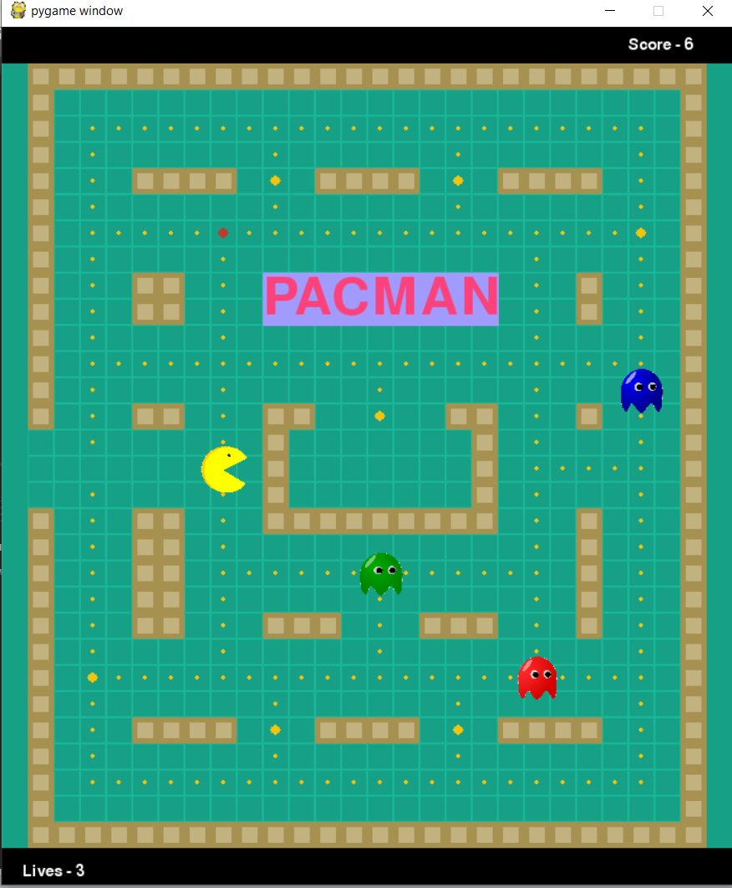

# Py-Man
Simple implementation of the classic arcade game Pac-Man, using pygame and python 3.

# Screenshot 

# Implementation Details
Code is written in python 3 using the pygame library. There is one main gameLoop within which control remains throughout the game's execution. Everything else is supporting functions that make the game work. Most functions used have a description at the top explaining their function and use. Finally, all of the other modules imported are automatically available with python. 

# Notes and Results
This is the first working draft of the game. There are as yet a few things that can be improved and a few issues to be ironed out, but the game in it's current state is definitely playable. I will update this as and when I make any major changes. One issue with the game is the lag between the keystroke and the movement of pacman. Because of this, the game may seem unresponsive at times, but you can get over that by clicking the arrow-keys several times furiously and there should not be a problem for now. 